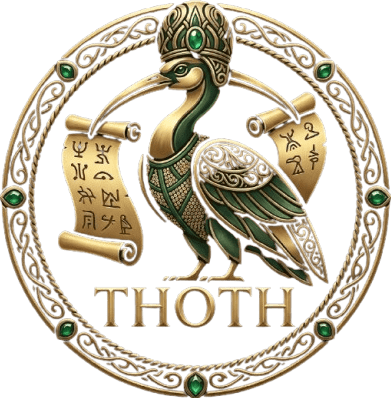

<p align="center">
  
</p>

<h1 align="center">Thoth</h1>
<p align="center"><em>"Thoth, scribe of the gods, keeper of knowledge."</em></p>

<p align="center">Long-term memory for claude coding agents. Embedded, Rust-native, code-aware.</p>

<p align="center"><strong>🇬🇧 English</strong> · <a href="./README.vi.md">🇻🇳 Tiếng Việt</a></p>


<p align="center">
  <a href="https://github.com/unknown-studio-dev/thoth/actions/workflows/ci.yml"></a>
  <a href="https://www.rust-lang.org/"></a>
  <a href="https://github.com/unknown-studio-dev/thoth/releases"></a>
  <a href="./LICENSE-MIT"></a>
</p>

> [!WARNING]
> **Work in progress — not production-ready.** Thoth is under active development (`0.0.1-alpha`). APIs, on-disk formats, and CLI flags may change without notice. Expect bugs, breaking changes, and incomplete features. Use at your own risk; do **not** rely on it for production workloads yet.

---

## What it is

Thoth is a Rust library (plus a CLI, an MCP server, and a one-shot
bootstrap that wires Claude Code) that gives a coding agent a
*persistent*, *disciplined* memory of a codebase. Three binaries do
all the work:

1. **`thoth`** — CLI: setup wizard, indexer, query, eval, memory ops.
2. **`thoth-mcp`** — MCP stdio server Claude Code talks to over `mcpServers`.
3. **`thoth-gate`** — `PreToolUse` hook that enforces "search before write".

`thoth setup` is the single command that installs hooks, registers the
MCP server, copies skills, and seeds `.thoth/`. There is no separate
plugin to install.

Five memory kinds, one store:

- **Semantic** — every symbol, call, import, reference, parsed by tree-sitter.
- **Episodic** — every query, answer, and outcome appended to an FTS5 log.
- **Procedural** — reusable skills stored as `agentskills.io`-compatible folders.
- **Reflective** — lessons learned from mistakes, confidence-scored in
  `LESSONS.md`, auto-quarantined when they start doing more harm than good.
- **Domain** — business rules, invariants, workflows and glossary ingested
  from Notion / Asana / NotebookLM / local files and snapshotted to
  `domain/<context>/` as reviewable markdown. Answers *"why does this
  enforce a $500 refund limit?"* — the code-aware → codebase-aware gap.
  See [ADR 0001](./docs/adr/0001-domain-memory.md).

Two operating modes:

- **`Mode::Zero`** — fully offline, deterministic. No LLM, no embedding API.
  Symbol lookup, graph traversal, BM25 via tantivy, RRF fusion.
- **`Mode::Full`** — plug in an `Embedder` (Voyage / OpenAI / Cohere) and/or
  a `Synthesizer` (Anthropic Claude) for semantic vector search and
  LLM-curated memory (the "nudge" flow). The default vector backend is a
  SQLite-resident flat cosine index (`vectors.db`) — zero extra infrastructure.
  Build with `--features lance` to swap in a LanceDB index (`chunks.lance/`)
  for larger corpora; the API is identical.

## Install

**One command.** Everything else happens at runtime.

```bash
# Zero-config: drops you into the setup wizard, then prints the next step.
npx @unknownstudio/thoth
```

That single invocation:

1. Downloads the prebuilt binary (`thoth`, `thoth-mcp`, `thoth-gate`)
   for your platform via npm.
2. Runs `thoth setup` — the interactive wizard that writes
   `.claude/settings.json` (MCP + hooks), copies skills into
   `.claude/skills/`, and seeds `.thoth/` with `config.toml`,
   `MEMORY.md`, `LESSONS.md`.
3. Tells you to review `.thoth/config.toml`, then run `thoth index .`.

Re-running `npx @unknownstudio/thoth` on a project that's already
bootstrapped detects the existing install and offers to reinstall
hooks, reconfigure, or self-heal missing pieces.

Other channels (same binaries, no Node required):

```bash
brew install unknown-studio-dev/thoth/thoth
# or
cargo install --git https://github.com/unknown-studio-dev/thoth thoth-cli thoth-mcp
# then:
thoth setup
```

## First use

Setup leaves you with a wired Claude Code project but an empty index.
One command to populate it:

```bash
cd your-project
thoth index .            # build the code index (incremental after this)
```

Open Claude Code in the project. `SessionStart` loads `LESSONS.md` /
`MEMORY.md`, `PreToolUse(Write|Edit|Bash|NotebookEdit)` fires
`thoth-gate`, and `Stop` triggers `thoth.reflect` to persist lessons.

Optional knobs (`mode`, `gate_relevance_threshold`,
`quarantine_failure_ratio`, …) live in `.thoth/config.toml`. Re-run
`thoth setup` any time you want to revisit the wizard; defaults are
sane, so skip if you don't care.

### Verify

```bash
thoth --version
thoth-gate < /dev/null    # should print {"decision":"approve",...}
# inside Claude Code:
/mcp                      # → thoth  ✓ connected
```

<!-- legacy anchors -->
<a id="getting-started"></a>
<a id="getting-started-in-30-seconds"></a>

## Configuration

`thoth setup` writes everything, but if you want to edit by hand,
`<root>/config.toml` looks like:

```toml
[memory]
episodic_ttl_days = 30
enable_nudge      = true

[discipline]
# Master switch — flip to `false` to disable the gate entirely.
nudge_before_write       = true
# Fall back to ~/.thoth when this project has no .thoth/.
global_fallback          = true
# `end` (only on Stop) or `every` (after each tool call).
reflect_cadence          = "end"
# `auto` commits straight to MEMORY.md/LESSONS.md.
# `review` stages to *.pending.md — user must promote/reject.
memory_mode              = "auto"

# --- gate v2 ---------------------------------------------------------
# Verdict on a relevance miss:
#   "off"    — disable the gate (pass silently).
#   "nudge"  — pass + stderr warning.  [default]
#   "strict" — block.
mode                     = "nudge"
# Recency shortcut — a recall within this window passes without a
# relevance check. Short so ritual recall ("recall once, edit forever")
# can't sneak past.
gate_window_short_secs   = 60
# Relevance pool — how far back the gate looks for a topically matching
# recall when scoring the upcoming edit.
gate_window_long_secs    = 1800
# Containment ratio in [0.0, 1.0] — 0 disables relevance, 0.30 balanced,
# 0.50 strict. See the comment block in the generated config.toml.
gate_relevance_threshold = 0.30
# Append every decision to .thoth/gate.jsonl. Useful for calibration.
gate_telemetry_enabled   = false

# Optional: Bash prefixes that always bypass the gate (additive with
# built-ins like `cargo test`, `git status`, `grep`).
# gate_bash_readonly_prefixes = ["pnpm lint", "just check"]

# Actor-specific overrides. `THOTH_ACTOR` env var selects the policy;
# first matching glob wins. Useful when you want different gate
# behaviour for interactive Claude Code vs. an orchestrated worker
# pipeline vs. a CI bot.
# [[discipline.policies]]
# actor = "hoangsa/*"                # wave workers in a bounded-context orchestrator
# mode = "nudge"
# window_short_secs = 300
# relevance_threshold = 0.20
#
# [[discipline.policies]]
# actor = "ci-*"                     # trusted automation
# mode = "off"

grounding_check          = false
quarantine_failure_ratio = 0.66
quarantine_min_attempts  = 5
```

| Scenario                                         | `mode`   | `gate_relevance_threshold` | `memory_mode` |
|--------------------------------------------------|----------|----------------------------|---------------|
| Solo, low-friction (just get reminded)           | `nudge`  | `0.30`                     | `auto`        |
| Solo, careful (block on unrelated edits)         | `strict` | `0.30`                     | `auto`        |
| Team, experimental (review every memory write)   | `strict` | `0.30`                     | `review`      |
| Permissive warnings only                         | `nudge`  | `0.15`                     | `auto`        |
| Tight discipline (requires focused recall)       | `strict` | `0.50`                     | `auto`        |
| Automation / CI                                  | `off`    | —                          | `auto`        |

**Legacy fields** (`mode = "soft"`, `gate_window_secs`,
`gate_require_nudge`) are still parsed for backward compatibility —
`soft` maps to `nudge`, `gate_window_secs` becomes `window_short_secs`,
and `gate_require_nudge` emits a deprecation hint. Re-run `thoth setup`
to migrate to the v2 schema.

## Architecture

```
  ┌── Cowork / Claude Code ────────────────────────────────────────────┐
  │                                                                    │
  │   .claude/settings.json     installed by `thoth setup`             │
  │   ├── hooks                  SessionStart / PreToolUse /           │
  │   │                          PostToolUse / Stop                    │
  │   ├── mcpServers.thoth       launches `thoth-mcp`                  │
  │   └── .claude/skills/        memory-discipline + thoth-reflect     │
  │          │                                                         │
  │          ▼                                                         │
  │   thoth-gate  ─ read-only SQLite check ─► episodes.db              │
  │   (PreToolUse command hook, blocks on missing recall / nudge)      │
  │                                                                    │
  └────────────────────────┬───────────────────────────────────────────┘
                           │ JSON-RPC / stdio
                           ▼
  ┌── thoth-mcp ───────────────────────────────────────────────────────┐
  │   tools    thoth_recall, thoth_remember_*, thoth_memory_*,         │
  │            thoth_request_review, thoth_skill_propose, …            │
  │   prompts  thoth.nudge  (logs NudgeInvoked event)                  │
  │            thoth.reflect                                           │
  │            thoth.grounding_check                                   │
  │   resources thoth://memory/MEMORY.md, thoth://memory/LESSONS.md    │
  └────────────────────────┬───────────────────────────────────────────┘
                           │
                           ▼
  ┌── `.thoth/` store ─────────────────────────────────────────────────┐
  │   episodes.db           event log (query_issued, nudge_invoked…)   │
  │   graph.redb            symbol graph (Calls, Imports, Extends,     │
  │                         References, DeclaredIn edges)              │
  │   fts.tantivy/          BM25 index                                 │
  │   vectors.db            flat cosine vector index (Mode::Full)      │
  │   chunks.lance/         LanceDB vector index (Mode::Full + `lance`)│
  │   MEMORY.md             declarative facts                          │
  │   LESSONS.md            reflective lessons (active)                │
  │   LESSONS.quarantined.md  lessons auto-demoted after repeated miss │
  │   MEMORY.pending.md, LESSONS.pending.md  staged in `review` mode   │
  │   memory-history.jsonl  versioned audit trail                      │
  │   gate.jsonl            gate decisions (when telemetry enabled)    │
  │   domain/<ctx>/DOMAIN.md        accepted business rules            │
  │   domain/<ctx>/_remote/<src>/*  ingestor-written proposed snapshots│
  │   skills/               procedural skills                          │
  └────────────────────────────────────────────────────────────────────┘
```

Three enforcement layers, ordered by how bypassable they are:

1. **Prompts + skills** — SessionStart hook dumps lessons in context;
   `memory-discipline` skill guides the agent through recall/nudge/act/reflect.
2. **Hook prompts** — PreToolUse/PostToolUse hooks push short reminders
   that are hard to miss but still text.
3. **`thoth-gate`** — a native binary runs on every `Write` / `Edit` /
   `Bash` / `NotebookEdit` PreToolUse and decides from three factors:
   - **Intent.** Read-only Bash (cargo test / git status / grep / rg /
     ls / cat / ...) bypasses silently. Mutation tools continue to step 2.
   - **Recency.** If a `query_issued` event landed within
     `gate_window_short_secs`, the call passes without a relevance check.
     The short default (60s) deliberately kills "recall once, edit
     forever" patterns.
   - **Relevance.** Past the short window, the gate tokenises the edit
     context (file basename, old/new strings, diff body) and scores
     containment against every recall within `gate_window_long_secs`.
     Score ≥ `gate_relevance_threshold` passes; otherwise the policy's
     `mode` decides — `off` passes silently, `nudge` passes with a
     stderr warning, `strict` emits `{"decision":"block"}`.

   The stderr message is actionable: it lists the edit tokens, the
   top-ranked recent recalls with their overlap score, and a suggested
   `thoth_recall` query built from the tokens no recall covered. The
   agent can copy-paste it to unblock itself.

   Actor-aware policies (`THOTH_ACTOR` env var + `[[discipline.policies]]`
   glob patterns) let you run one gate binary with different thresholds
   per caller — interactive Claude Code strict, orchestrated workers
   nudge-only, CI off.

   Optional `gate_telemetry_enabled = true` writes every decision to
   `.thoth/gate.jsonl` so you can calibrate the threshold from real
   behaviour instead of guessing.

`thoth-gate` fails open on any error (missing DB, unreadable config) so
a broken gate never bricks your editor — at the cost of silently
reverting to `nudge` mode. Check stderr if the gate feels weaker than
expected.

## CLI cheatsheet

```bash
# project lifecycle
thoth setup                               # interactive config wizard
thoth setup --status                      # print detected install state
thoth init                                # create .thoth/
thoth index .                             # parse + index
thoth watch .                             # stay resident, reindex on change
thoth query "how does the nudge flow work"

# graph-centric analysis (over the code graph built by `thoth index`)
thoth impact  "module::symbol" --direction up -d 3         # blast radius
thoth context "module::symbol"                             # 360° symbol view
thoth changes --from -                                      # piped git diff
thoth changes                                               # defaults to `git diff HEAD`

# memory
thoth memory show
thoth memory fact "Auth tokens expire after 15m" --tags auth,jwt
thoth memory lesson --when "touching db/migrations" "run make db-check"
thoth memory pending                      # review queue (review mode)
thoth memory promote lesson 0
thoth memory reject  fact   2 --reason "duplicate"
thoth memory log --limit 50               # audit trail from memory-history.jsonl
thoth memory forget                       # TTL + quarantine pass
thoth --synth anthropic memory nudge      # LLM-curated lesson proposals

# domain (business-rule memory — needs the matching cargo feature)
thoth domain sync --source file       --from ./specs/          # air-gapped / tests
thoth domain sync --source notion     --project-id <database-id>  # needs NOTION_TOKEN
thoth domain sync --source asana      --project-id <gid>          # needs ASANA_TOKEN
thoth domain sync --source notebooklm                          # stub; export → file

# Claude Code wiring
thoth install                             # skills + hooks + MCP, project scope
thoth install --scope user                # global
thoth uninstall                           # remove in that scope

# eval — precision@k / MRR / latency p50·p95, optional Zero vs. Full ablation
thoth eval --gold eval/gold.toml -k 8
thoth eval --gold eval/gold.toml --mode both --embedder voyage
```

Run `thoth --help` for the full surface.

## MCP server

`thoth-mcp` speaks JSON-RPC 2.0 over stdio (MCP version `2024-11-05`).
Tools published:

| Tool                       | What it does                                                              |
|----------------------------|---------------------------------------------------------------------------|
| `thoth_recall`             | Mode::Zero hybrid recall (symbol + BM25 + graph + markdown, RRF-fused)    |
| `thoth_index`              | Walk + parse + index a path                                               |
| `thoth_impact`             | Blast-radius analysis — who breaks if `fqn` changes (depth-grouped BFS)   |
| `thoth_symbol_context`     | 360° view of a symbol: callers / callees / extends / extended_by / siblings |
| `thoth_detect_changes`     | Parse a unified diff → touched symbols + upstream blast radius            |
| `thoth_remember_fact`      | Append / stage a fact                                                     |
| `thoth_remember_lesson`    | Append / stage a lesson (refuses to silently overwrite)                   |
| `thoth_memory_show`        | Read both markdown files                                                  |
| `thoth_memory_pending`     | List staged entries                                                       |
| `thoth_memory_promote`     | Accept a staged entry                                                     |
| `thoth_memory_reject`      | Drop a staged entry with a reason                                         |
| `thoth_memory_history`     | Tail `memory-history.jsonl`                                               |
| `thoth_memory_forget`      | TTL + capacity eviction + auto-quarantine pass                            |
| `thoth_episode_append`     | Append an observed event (file edit, outcome, …) from a hook              |
| `thoth_lesson_outcome`     | Bump success/failure counters on a lesson                                 |
| `thoth_request_review`     | Flag something for human audit                                            |
| `thoth_skill_propose`      | Draft a new skill from ≥5 consolidated lessons                            |
| `thoth_skills_list`        | Enumerate installed skills                                                |

Plus two resources (`thoth://memory/MEMORY.md`, `thoth://memory/LESSONS.md`)
and three prompts (`thoth.nudge`, `thoth.reflect`, `thoth.grounding_check`)
— the nudge prompt logs a `NudgeInvoked` event the reflect pass
consumes; `thoth.grounding_check` asks the agent to verify a factual
claim against the indexed codebase before asserting it.

## Graph-centric analysis

`thoth index` builds a symbol graph with `Calls`, `Imports`, `Extends`,
`References` and `DeclaredIn` edges. Three MCP tools (and matching CLI
subcommands) expose it directly without a hybrid-recall round trip —
useful once an agent already knows which symbol it cares about.

| Use case                                              | Tool / CLI                                 |
|-------------------------------------------------------|--------------------------------------------|
| *"What breaks if I change `Foo::bar`?"*               | `thoth_impact` / `thoth impact`            |
| *"Show me everything around `Foo::bar`"*              | `thoth_symbol_context` / `thoth context`   |
| *"Which symbols do this PR's hunks actually touch?"*  | `thoth_detect_changes` / `thoth changes`   |

- **`thoth impact`** walks BFS from the symbol — `--direction up`
  (default) follows incoming `Calls`, `References`, `Extends` edges for
  "who depends on me"; `--direction down` follows outgoing edges for
  "what do I depend on". Results are grouped by depth so you can see
  direct callers separately from transitive ones.
- **`thoth context`** returns a categorised 360° view: callers, callees,
  parent types, subtypes, references, siblings in the same file, and
  any external imports the graph couldn't resolve (so third-party
  dependencies are visible without being injected as stub nodes).
- **`thoth changes`** parses a unified diff (either from `--from <file>`,
  `--from -` for stdin, or `git diff HEAD` by default), intersects each
  hunk's line range with the declaration spans of indexed symbols, and
  returns the touched symbols plus their upstream blast radius. Handy
  as a PR pre-check: "these 7 functions need re-testing because you
  modified X".

The indexer now resolves call targets through a file-local map built
from import aliases (`use foo::Bar as Baz` / `import { a as b }` /
`from x import y as z` / Go aliased imports) and same-file symbols,
so `Calls` edges connect across modules instead of dead-ending at the
bare leaf name. Class / trait inheritance emits `Extends` edges so the
two inheritance-aware columns in `symbol_context` (extends / extended_by)
populate for Rust `impl Trait for Type`, TypeScript `extends` /
`implements`, Python multi-inheritance, and friends.

## Domain memory (business rules)

Thoth's sixth memory kind (see [ADR 0001](./docs/adr/0001-domain-memory.md))
captures the *why* — business rules, invariants, workflows and glossary —
that lives outside the AST. It's a separate code path from the rest of
memory on purpose:

- **Ingest only on command.** `thoth domain sync` pulls from the selected
  remote. `recall()` never hits the network — Mode::Zero stays deterministic.
- **Snapshot-based.** Each rule lands as a single markdown file with TOML
  frontmatter (`id`, `source`, `source_hash`, `context`, `kind`,
  `last_synced`, `status`). `source_hash` (blake3) makes re-sync a no-op
  when nothing upstream changed.
- **Suggest-only merge.** Ingestor output goes to `## Proposed`. Humans
  (or CODEOWNERS) promote entries to `## Accepted` via PR. Retrieval
  ranks Accepted first.
- **Redaction first.** JWTs, provider tokens (`sk-`, `xoxb-`, `ghp_`, …),
  16-digit card numbers and AWS access keys are scanned before any write;
  hits drop the rule and log a `redacted` counter.

Build feature flags in `thoth-cli` (all opt-in, none on by default):

```bash
cargo install --git https://github.com/unknown-studio-dev/thoth \
  thoth-cli --features "notion,asana,notebooklm"
# or: thoth-cli --features full   (everything)
```

Adapters:

| Adapter | Feature | Auth | Notes |
|---|---|---|---|
| `file` | always on | — | reads `*.toml` from a directory; for air-gapped use and tests |
| `notion` | `notion` | `NOTION_TOKEN` | queries one database; routes by `Thoth.Context` property |
| `asana` | `asana` | `ASANA_TOKEN` | queries one project; routes by `Thoth.Context` custom field |
| `notebooklm` | `notebooklm` | — | stub until MCP lands; use export → `file` adapter |

Route rules to bounded contexts by setting a `Thoth.Context` property /
custom field on the source side; any rule without a context is dropped
(the `unmapped` stat). This is the ADR 0001 rule that PMs opt a record
into Thoth explicitly.

## Release flow

- Tag `vX.Y.Z` on `main`.
- `.github/workflows/release.yml` builds `aarch64-apple-darwin`,
  `x86_64-apple-darwin`, `aarch64-unknown-linux-gnu`,
  `x86_64-unknown-linux-gnu`, uploads tarballs + sha256s to the GitHub
  Release.
- `packaging/homebrew/bump.sh vX.Y.Z` stamps fresh SHAs into the formula
  — copy output to your tap's `Formula/thoth.rb` and push.
- `packaging/npm/publish.sh vX.Y.Z` re-packs the tarballs as npm packages
  and publishes (+ optional `DRY_RUN=1`).

## Embedding as a library

Mode::Zero:

```rust
use thoth_core::Query;
use thoth_parse::LanguageRegistry;
use thoth_retrieve::{Indexer, Retriever};
use thoth_store::StoreRoot;

let store = StoreRoot::open(".thoth").await?;
Indexer::new(store.clone(), LanguageRegistry::new())
    .index_path(".")
    .await?;

let r = Retriever::new(store);
let out = r.recall(&Query::text("token refresh logic")).await?;
for chunk in out.chunks {
    println!("{:?}  {}:{}  {}", chunk.source, chunk.path.display(),
             chunk.span.0, chunk.preview);
}
```

Mode::Full — add an embedder and/or a synthesizer:

```rust
use std::sync::Arc;
use thoth_core::{Embedder, Query, Synthesizer};
use thoth_embed::voyage::VoyageEmbedder;
use thoth_synth::anthropic::AnthropicSynthesizer;
use thoth_parse::LanguageRegistry;
use thoth_retrieve::{Indexer, Retriever};
use thoth_store::{StoreRoot, VectorStore};

let store    = StoreRoot::open(".thoth").await?;
// `vectors_path` resolves to `vectors.db` by default, or `chunks.lance/`
// when built with `--features lance`. The `VectorStore` type alias follows.
let vectors  = VectorStore::open(&StoreRoot::vectors_path(".thoth".as_ref())).await?;
let embed: Arc<dyn Embedder>   = Arc::new(VoyageEmbedder::from_env()?);
let synth: Arc<dyn Synthesizer> = Arc::new(AnthropicSynthesizer::from_env()?);

Indexer::new(store.clone(), LanguageRegistry::new())
    .with_embedding(embed.clone(), vectors.clone())
    .index_path(".")
    .await?;

let r = Retriever::with_full(store, Some(vectors), Some(embed), Some(synth));
let out = r.recall_full(&Query::text("how does the nudge flow work")).await?;
println!("{}", out.synthesized.unwrap_or_default());
```

## Contributing

Bug reports, feature requests, memory-drift reports, translations and
PRs are all welcome. See [`CONTRIBUTING.md`](./CONTRIBUTING.md) for the
workflow, code style, and issue templates.

## Status

**Alpha.** Design frozen in [`DESIGN.md`](docs/DESIGN.md). Milestones M1–M6
(parse + store + graph + retrieve + CLI + MCP + Mode::Full + discipline
hooks/skills bundled by `thoth setup`) are in. **M7 — Domain memory**
(the `thoth-domain` crate with file / Notion / Asana / NotebookLM
adapters and `thoth domain sync` CLI) landed in 0.0.1-alpha; the
MCP-universal ingestor remains on the roadmap.

## License

Licensed under either of Apache License 2.0 ([LICENSE-APACHE](./LICENSE-APACHE))
or the MIT license ([LICENSE-MIT](./LICENSE-MIT)), at your option.

Unless you explicitly state otherwise, any contribution intentionally
submitted for inclusion in the work by you, as defined in the Apache-2.0
license, shall be dual licensed as above, without any additional terms or
conditions.
